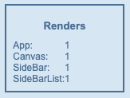
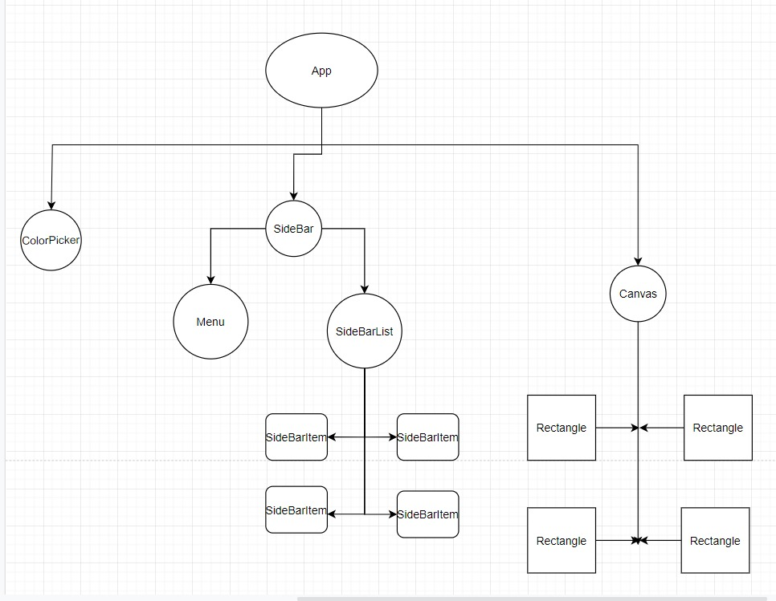

# Recoil Tutorial

In the following project you will be introduced with the advantages of recoil for state managment and application efficiency.
So before we dive in we would like you to see a few things:

1. Cover the [Basics](https://www.youtube.com/watch?v=_ISAA_Jt9kI&feature=emb_title&ab_channel=ReactEurope)
2. Understanding [Core concepts](https://recoiljs.org/docs/introduction/core-concepts)
3. Practice makes perfect! Do the [To-do List](https://recoiljs.org/docs/basic-tutorial/intro) mini project to get used to the syntax.

**Please do not change the boiler templates id's and class names.**

## Tips

_Try to name variables according to the convention, it wont be tested._

_dont forget to wrap your root component with the RecoilRoot provider._

_Download the React Developer Tools extension in chrome. There is an option to highlight a component every time it renders: General > Highlight updates when component renders (you need to keep the react dev tools open)_

## Introduction to the challenge

at that challenge you will be given with a bolierplate to non working App, at each task, you will need to accomplish some functionallity. initially without Recoil and then with Recoil state.
That way you will be really exposed to the advantages of that technology.

for your own understanding, DO NOT complete each task directrly with recoil, Go with the Given workFlow, it was thought through and its the optimal way to grasp the concept.

First we will introduce the render meter that will count the number of renders for each of our 4 main components (App, Canvas, SideBar, SideBarList). As you saw in the links above using the recoil let's us make changes to different unrelated components without having to render the main App component or any other component.
At the start of the app you will see a render meter that counts the number of renders each component had, you will see that each component rendered once at the start of the app.



# Lets Jump ahead!

## Task 1: Fix the ColorPicker component!

so after reading the docs and practicing the 'TODO-LIST' we can start out first task.

at the current situation you are given with an App can pick a color but nothing happens. we will need to fix the functionality (without recoil) so the selected color will be the canvas background color!

pay attention to the App render meter.
the app compenent renders each time the color changes.

with recoil we can avoid unnecessary renders, by connecting components via Atoms without going throgh the compnent tree let's get to it!

## Task 2: Replace regular state with recoil!

Create an atom state that saves the selected color In a new file. Call the atom canvasBackgroundColorState.
In colorPicker file import the atom from it's file and use it as a recoil state:

```
const [backgroundColor, setBackgroundColor] = useRecoilState(canvasBackgroundColorState);
```

then create an onChange function that sets the backgroundColor of the app as: `setBackgroundColor()`
In Canvas save locally the current background color using:

```
useRecoilValue(--name of atom--)
```

## Task 3: Add rectangles to canvas functionality!

A rectangle has: id ,name ,width ,height and color properties.

In order to add a rectangle to the canvas we need to save it somewhere:
So first create an atom state that saves an array of objects, and call it 'rectanglesArrayState'. It's default prop is an empty array. then
import 'rectanglesArrayState' to SideBarList and Canvas components as a recoilValue.
In Canvas render each array item as a Rectangle component and import 'rectanglesArrayState' to Menu and use it as a recoil state (like in task 2).
Include a counter called idCounter that saves the current number of rectangles, and implement a submitShape function so you can add a rectangle to the 'rectanglesArrayState' recoil state.

## Tasks 4: Add an edit option to SideBarItem!

In SideBarList render: each item should have the following props so we can update them:

1. Name: //string read only
2. Width: //input type=text
3. Height //input type=text
4. Color: //input type=color
   After we change the render method, we need to handle the `onChange` event when we update when of the props.

### After task 1: App re-rendered every time we changed Canvas's background.

### After test 2: App renders one time regardless the amount of times we changed the color.

### After test 4: Every time we edit a rectangle prop, SideBarList renders one time and the whole Canvas component re renders instead of just one of it's items.

### But what if we can make it **even more** efficient?

### facing the problem of creating a dynamic new state more introduction to atomfamily

## Task 5: To Efficiency and beyond!

### Your quest is going well. It's time we introduce you to [**Atom Family**](https://recoiljs.org/docs/api-reference/utils/atomFamily/).

Another [good resource](https://www.youtube.com/watch?v=9JVE8OGRSlA)

```
export const rectAtomFamily = atomFamily({
	key: "rectAtom",
	default: id => ({
		name: `Rect ${id}`
	})
});
```

Change **rectanglesArrayState**'s name to: **rectangleIdArrayState**, don't forget to change the name in the Menu, SideBarList and Canvas components.
Create an atom family in a new file, in Canvas and SideBarList components change the render method: instead of passing over the props, pass over only the id.
In Menu component import the rectAtomFamily and use it to create a recoil state:

```
const [rectAtom, setRectAtom] = useRecoilState(rectAtomFamily(idCounter));
```

This line is what connects between the rectangleIdArrayState and the rectAtomFamily In a nutshell, for the same input to the same atomFamily, the function will return the same piece of state (atom).

Change your submitShape function so it is set's rectAtom and add's it's id to rectangleIdArrayState after each submit
In the Rectangle and SideBarItem components import the familyAtom, use the atom in Rectangle as a value and in SideBarItem as a state.
Change the edit handling function in SideBarItem so it sets rectAtom in the same two components add the recieved prop rectId passed from their father components.

## Tests:

- Task 1,2 _npm run first_
- Task 3 _npm run addRect_
- Task 4,5 _npm run changeRect_

## Bonus: try taking a look at the render meter mechanism and implement it yourself!


